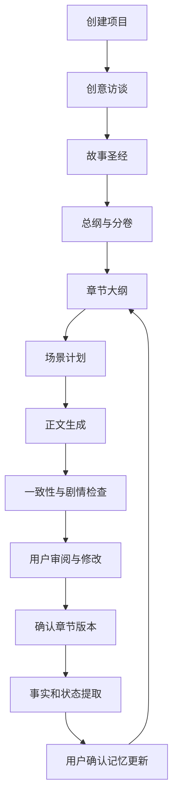

# AI 长篇小说创作智能体产品需求文档

- 文档版本：V1.0
- 产品代号：Novel Agent
- 目标平台：Web
- 目标用户：中文网文作者、小说创作爱好者
- 核心模式：AI 主笔/助手，用户主编

## 1. 产品定义

Novel Agent 是一款面向长篇小说创作的 AI 智能工作台。产品通过结构化故事设定、分层剧情规划、动态状态管理、上下文检索和自动审校，帮助用户完成创意孵化、世界观与人物设计、故事规划、正文写作、局部修订和长篇一致性管理。

产品不以“一键生成整本小说”为核心，而以“持续、可控地完成一部长篇小说”为核心。

### 核心价值

1. 长篇一致性：记住角色、规则、事件、物品和人物认知。
2. 剧情可控：正文受总纲、章节目标、场景计划和用户指令约束。
3. 人机协作：关键操作可批准、拒绝、修改和回退。
4. 创作资产化：设定、人物、伏笔、时间线和正文均可独立管理。

## 2. 产品目标与边界

### 2.1 产品目标

- 完成从一句创意到连续章节正文的闭环。
- 用结构化记忆改善跨章节一致性。
- 降低用户规划、卡文、校对和局部返工成本。
- 使所有 AI 生成结果可追踪、可比较、可撤销。

### 2.2 核心指标

| 指标 | 目标 |
|---|---:|
| 创建项目后完成故事设定的比例 | ≥ 60% |
| 完成首章正文的比例 | ≥ 40% |
| 完成至少 5 章的比例 | ≥ 20% |
| AI 正文平均采纳率 | ≥ 50% |
| 单章生成后平均局部重写次数 | ≤ 3 |
| 严重设定冲突检出率 | ≥ 80% |
| AI 生成任务成功率 | ≥ 98% |
| 章节生成 P95 时长 | ≤ 90 秒 |

### 2.3 不在当前范围

- 无人值守的百万字自动连载
- 自动发布至小说平台
- 多人实时协作、作品交易和版权服务
- 自训练基础模型
- 社区、评论、读者运营和原生移动端

## 3. 用户与场景

### 3.1 核心用户：网文创作者

需要稳定更新、快速规划章节、保持设定一致、管理伏笔并定向修订正文。

### 3.2 次要用户：小说创作爱好者

有创意但缺乏系统写作经验，需要访谈式引导、候选方案和分步骤创作。

### 3.3 典型场景

- 从一句想法生成故事方案、人物卡、总纲、分卷和前若干章大纲。
- 根据章节卡、人物状态、历史事件和伏笔生成场景及正文。
- 选中文字，保持事件结果不变，定向调整对白、节奏或描写。
- 发现角色提前知晓秘密、能力尚未获得、物品归属错误等矛盾。

## 4. 产品工作流

## 5. 功能需求

优先级：P0 为首个可用版本必需，P1 为优先增强，P2 为后续能力。

### 5.1 项目管理（P0）

- 创建项目：名称、类型、目标字数、章节数、单章字数、叙事视角、目标读者、内容尺度和创作模式。
- 创作模式：引导、快速、空白。
- 项目列表显示字数、章节进度和最近编辑时间。
- 支持重命名、复制、归档和进入回收站的软删除。
- 修改项目参数不得自动覆盖已有正文。

### 5.2 创意访谈（P0）

- 采集题材、主角、目标、阻碍、世界规则、基调、卖点、结局倾向和禁止内容。
- 每轮最多 3 个问题；允许“不确定”，并提供 2—4 个候选方向。
- 不重复询问已有答案，用户可随时结束访谈。
- 生成 3 个包含一句话故事、核心冲突、卖点、人物成长和风险的方案。
- 支持选定一个方案或合并多个方案。

### 5.3 故事圣经（P0）

- 管理主题、基调、世界规则、地点、势力、人物、物品、能力体系、文风和禁止事项。
- 每条设定记录类型、描述、硬性级别、来源、版本和关联对象。
- 硬性设定作为正文生成强制约束。
- 人物卡包含身份、外貌、性格、语言习惯、欲望、目标、需求、弱点、能力、秘密、关系、弧光和行为原则。
- 分开记录客观事实、角色自身认知和其他角色对其认知。
- P1：修改已被引用的设定时进行影响分析。

### 5.4 大纲规划（P0）

- 大纲采用五层结构：故事总纲、分卷规划、故事线、关键事件、章节规划；场景规划作为章节执行层。
- 故事总纲：核心创意、主题命题、主线目标、核心冲突、世界概述、主角成长弧和结局方向。
- 分卷规划：阶段目标、冲突、关键转折、人物变化、伏笔动作、章节范围和卷末状态；每卷应形成相对完整的小故事。
- 故事线：分别跟踪主线、谜团线、人物线、关系线和反派线的起点、目标、关键节点、交汇点、高潮与结局。
- 关键事件：记录触发条件、参与人物、事件内容、直接结果、长期影响和关联伏笔，以因果链而非章节顺序组织故事。
- 章节卡：标题、目标、视角、时间地点、人物、冲突、事件、信息释放、情绪变化、结果、钩子、伏笔和目标字数。
- 章节规划只是完整大纲的第五层，不得以章节列表代替故事总纲和因果结构。
- 支持批量生成、重新规划、拖拽排序、拆分、合并和节点锁定。
- 顺序调整后提示时间线、人物状态和伏笔影响。
- P1：下一步剧情提供 2—4 个方案及影响说明。

### 5.5 场景规划（P0）

- 场景卡包含目标、时间、地点、视角人物、参与人物、冲突、行动、情绪节拍、信息、结果、转场和预计字数。
- 支持排序、删除、重新生成和锁定。
- P1：检查场景是否推进剧情或人物、因果是否完整、信息是否重复、转场是否自然。

### 5.6 正文生成与改写（P0）

- 支持按场景生成、整章生成、光标续写和补全场景。
- 上下文包括风格要求、硬性设定、章节卡、场景卡、人物状态、上一章结尾、相关历史和伏笔。
- 可配置字数、节奏、描写密度、对话比例、情绪强度、必须内容和禁止内容。
- 生成结果先进入预览，用户确认后写入正式版本；锁定文本不能被覆盖。
- 选区支持润色、扩写、压缩、加强冲突/氛围、对白改写、语气调整、减少解释和自定义指令。
- 改写默认保持事件结果不变，只修改选区并显示差异。
- 续写前判断场景目标是否已完成，并提示结束、转场或补充细节。
- P1：用抽象语言特征配置文风，不提供直接模仿在世作者的预设。

### 5.7 质量检查

#### 一致性检查（P0）

检查人物身份、年龄外貌、地点、时间、物品、能力条件、角色认知、死亡/离场状态、世界规则和关系变化。每个问题包含严重度、位置、依据、解释、修复建议和修复入口。

#### 剧情检查（P0）

检查章节目标、核心冲突、事件因果、人物动机、节奏、重复信息、结尾钩子以及主线/支线/弧光推进。

#### 文本检查（P1）

检查重复表达、模板化套话、过度解释、对话辨识度、视角漂移、句式重复、无效描写和情绪失配。

质量建议不得未经确认自动修改正文。

### 5.8 状态与记忆（P0）

- 章节确认后提取事件、人物位置/身体、物品、能力、关系、秘密、角色认知、设定、伏笔和时间变化。
- 所有提取结果形成“状态更新提案”，经用户确认后写入正式记忆。
- 新旧事实冲突时支持保留旧事实、采用新事实、视为角色误解、创建设定例外或修改正文。
- 每章生成短摘要、详细摘要、人物变化、关键承诺、未解决问题和关联伏笔。

### 5.9 伏笔与时间线

- P0：伏笔记录名称、描述、类型、埋设/计划回收/实际回收章节、关联人物、重要度和状态。
- 伏笔状态：计划、已埋设、已强化、已误导、已回收、已废弃。
- P1：提醒长期未推进、即将回收、已回收仍作悬念和铺垫不足的伏笔。
- P0：时间线事件记录故事时间、时长、地点、人物、前置事件、后续影响和来源章节。
- 支持相对时间和未知时间；P1 提供按人物、地点筛选的时间线视图。

### 5.10 版本与导出（P0）

- 自动保存；AI 写入和接受改写前后创建版本。
- 支持版本命名、对比和恢复，恢复不删除后续历史。
- 导出 TXT、Markdown、DOCX；范围可选全书、卷、章节、仅正文或包含摘要/故事圣经。

## 6. AI 逻辑角色

| 角色 | 职责 | 输出 |
|---|---|---|
| 创意顾问 | 访谈和补全创意 | 创意方案 |
| 故事策划 | 总纲、分卷、章节规划 | 结构化大纲 |
| 场景设计师 | 章节拆分 | 场景卡 |
| 正文写作者 | 生成小说内容 | 自然语言 |
| 剧情编辑 | 因果、节奏、动机检查 | 问题清单 |
| 连贯性编辑 | 设定和状态检查 | 冲突报告 |
| 记忆管理员 | 从正文提取事实 | 状态更新提案 |

采用显式工作流编排，不建设角色自由协商式多智能体。

### 约束优先级

1. 安全与内容政策
2. 用户禁止事项
3. 锁定正文或设定
4. 硬性故事圣经
5. 已确认事实
6. 章节卡
7. 场景卡
8. 文风偏好
9. 模型自由创作

## 7. 上下文与检索

- 始终加载相关硬性规则、当前章节卡和场景卡。
- 加载出场人物相关字段、上一章结尾和最近 2—5 章摘要。
- 对历史事件进行结构化条件、关键词和向量混合检索。
- 明确事实优先查询结构化状态，不依赖向量相似度。
- 全部历史正文不直接进入上下文。

上下文超限时依次移除低相关原文、用摘要替代正文、压缩非核心人物、合并重复记忆；硬性规则和当前规划不可删除。

## 8. 非功能需求

### 性能与可靠性

- 页面首屏 ≤ 3 秒；自动保存 ≤ 2 秒；非 AI API P95 ≤ 500ms。
- AI 流式展示、可取消、可重试，失败不得覆盖正文。
- 正文自动保存间隔 ≤ 5 秒；章节写入使用事务保护。
- 数据库每日备份；删除项目进入至少 30 天回收站。

### 安全与隐私

- 项目按用户隔离，传输和存储加密。
- 日志不记录完整正文和密钥。
- 用户可导出和删除数据。
- 默认不将用户作品用于模型训练。

### 可观测性

记录任务类型、提示词版本、模型、上下文来源、输出、Token、耗时、成本、错误、采纳状态和采纳字符比例。

### 计量与付费预留

首版即记录每日生成字数、模型调用次数、Token、项目数量、存储空间和高级检查次数。后续权益可按模型等级、月度额度、项目数、上下文容量、高级检查和导出格式划分；不建议按每次点击单独收费。

### 数据分析事件

核心事件包括：`project_created`、`interview_started`、`interview_completed`、`story_plan_generated`、`story_plan_accepted`、`chapter_outline_generated`、`chapter_generation_started`、`chapter_generation_completed`、`chapter_generation_cancelled`、`ai_content_accepted`、`ai_content_rejected`、`rewrite_requested`、`rewrite_accepted`、`consistency_check_completed`、`review_issue_fixed`、`state_proposal_accepted`、`state_proposal_rejected`、`chapter_completed` 和 `project_exported`。

事件属性至少包含项目类型、创作模式、任务类型、模型、生成字数、耗时、采纳字符数、重试次数、问题类型和用户创作阶段。

## 9. 异常处理

- 结构化输出错误自动修复重试一次；再次失败不得写库。
- AI 生成期间用户编辑时，结果保留在独立预览；接受前检查基线版本。
- 设定与大纲冲突时展示双方和影响，不擅自决定。
- 生成前后执行内容安全检查，局部问题不得删除已有作品。

## 10. 发布验收

1. 从一句创意创建项目并生成故事圣经。
2. 生成人物、总纲、分卷和至少 10 章大纲。
3. 连续生成 3 章，第 2 章可正确引用第 1 章事实。
4. 选区改写可预览差异并只影响选区。
5. 能检出人工植入的设定冲突并给出依据。
6. 章节确认后生成摘要和状态更新提案。
7. 拒绝状态提案后正式记忆不变化。
8. 可恢复历史版本并导出完整作品。
9. 任意 AI 调用失败不导致正文丢失。

## 11. 产品决策

- 优先服务中文网文作者。
- 默认采用“章节卡 → 场景卡 → 正文”。
- 默认按场景生成，整章生成作为快捷入口。
- 设定和状态结构化保存，历史正文混合检索。
- 新事实必须经确认才能进入正式记忆。
- AI 修改使用差异预览，不直接覆盖正文。
- 第一阶段重点验证连续创作 5—20 章的体验。
